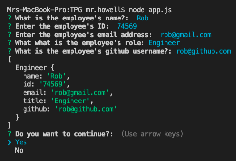

# Team Profile Generator
## The A Team

## Description and how it work?

A prompt is giving to user for information about the employee and then information about the team members. The user can input any number of team members, and they may be a mix of manager, engineers and interns. The assignment also has unit tests. When the user has completed building the team, the application will create an HTML file that displays a nicely formatted team roster based on the information provided by the user.

walk-through

https://user-images.githubusercontent.com/79549867/117557625-efa79700-b042-11eb-8838-22f43b4ab02e.mov

---
For example: 
If you select "intern" you will need to fill out
name, id, email, school

If you select "manager" you will need to fill out 
name, id, email, offce number, 

If you select "engineer" you will need to fill out
name, id, email, github

## The application is using?
NPM module jest
NPM module inquirer
javascript
node.js
font awesome

